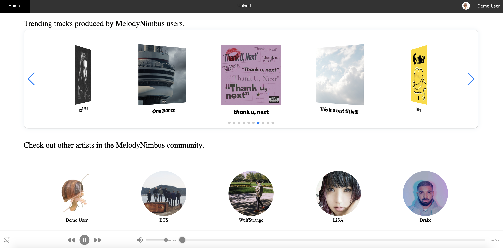
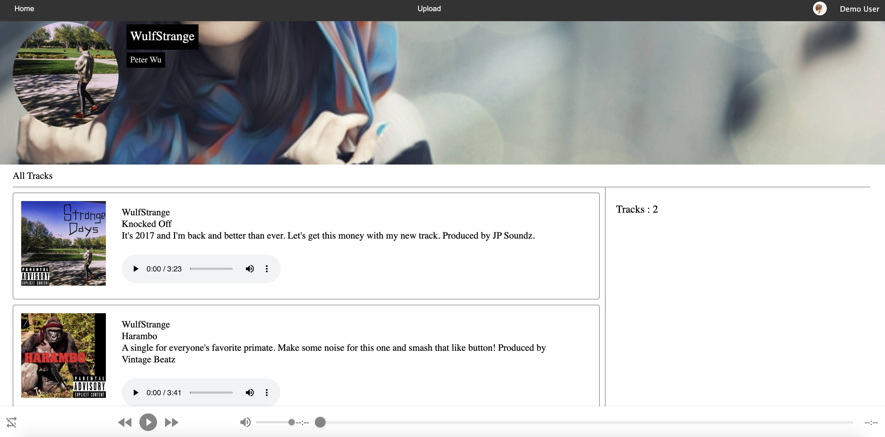
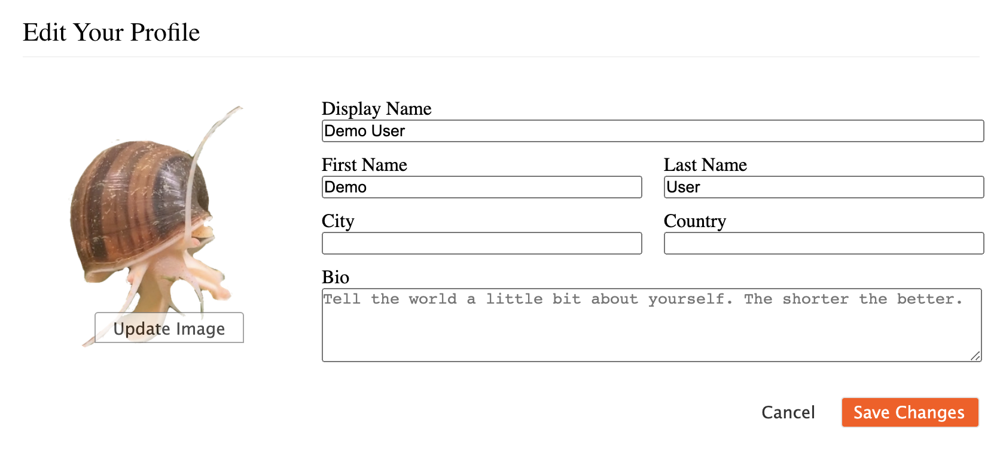
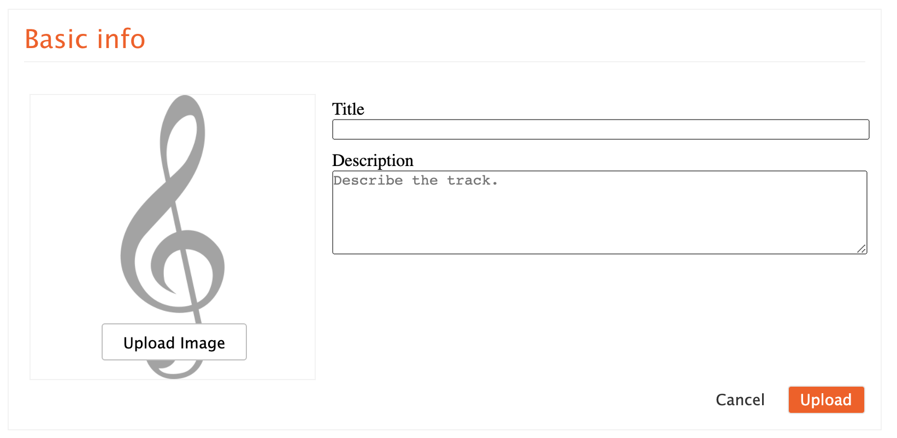

# MelodyNimbus

### [MelodyNimbus](https://melodynimbus.herokuapp.com/) is a SoundCloud inspired website designed for users to be able to upload and share music.

## To learn more about MelodyNimbus, you can check out the wiki!
  * Database Schema - https://github.com/jimsonm/MelodyNimbus/wiki/Database-Schema
  * Feature List - https://github.com/jimsonm/MelodyNimbus/wiki/Feature-List
  
## Technologies Used
  * JavaScript
  * HTML
  * CSS
  * React
  * Redux
  * PostgreSQL
  * Sequelize
  * AWS S3
  * Express
  * Heroku
 
## Home Page
 

</img>

 

## User Profile Page
 

</img>

 

## Editting your Profile
 

</img>

 

## Creating a Track
 

</img>

 
 
 ## Future Features:
  - [ ] Persisting Music Player
  - [ ] Track Comments
  - [ ] Search Feature for tracks and/or users
